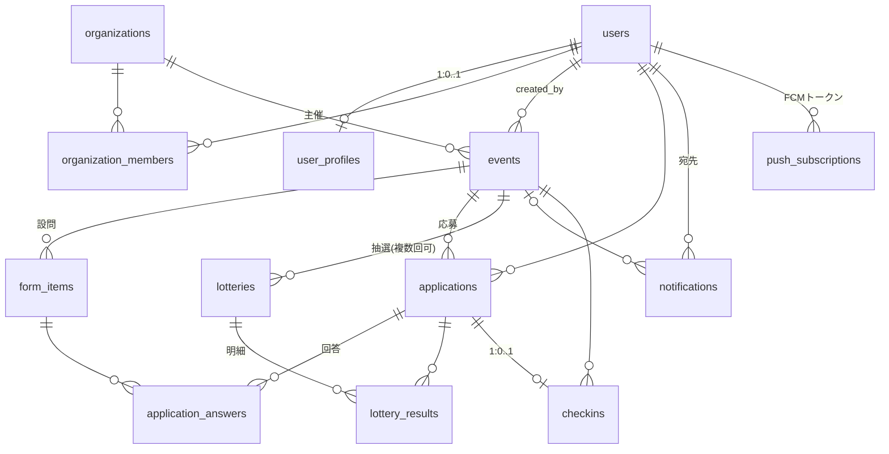
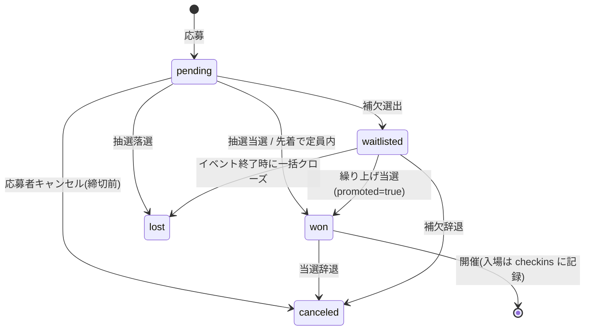

# EventDeck VR データベース設計書

対応する要件定義書: 「EventDeckVR_要件定義書」(クラウドプラットフォーム実習Ⅱ レポート5)
対象RDBMS: PostgreSQL 16 / DDL: `schema.sql`(PostgreSQL 16.14 で全文実行・制約テスト済み)

このドキュメントと `schema.sql` が実装時の正とする。実装(SQLAlchemyモデル・Alembicマイグレーション)はこのDDLと一致させること。

---

## 1. 要件定義書からの差分

要件定義書のテーブル一覧(10テーブル)に対し、詳細設計で以下の3テーブルを追加した。

| 追加テーブル | 理由 |
|---|---|
| `organization_members` | 1団体に複数の主催者ユーザーが所属できるようにするため(users と organizations の多対多)。要件定義書の「主催者ユーザー1名あたり月額課金」はこのテーブルの行数で数える |
| `lottery_results` | 抽選の公平性の証跡として「どの応募が・どの枠で・何位で・どう扱われたか」を全件保存するため。`applications.status` 更新の根拠となる |
| `push_subscriptions` | FCMプッシュ通知の宛先トークンを端末ごとに保持するため |

要件定義書の `lotteries`「乱数シード」は `seed` + `algorithm_version` + `config`(設定スナップショット)の3点セットに拡張し、後から結果を完全再現できるようにした。

## 2. 設計上の決定事項

1. **主キーは全テーブル UUID**(`gen_random_uuid()`)。公開URLにIDが露出するため連番による推測・列挙を防ぐ。
2. **「主催者」はロール列ではなく所属で表現する。** `users` に organizer フラグは持たせない。`organization_members` に行があるユーザーが主催者画面を使える。1人のユーザーが参加者と主催者を兼ねられる。
3. **日時はすべて `timestamptz`**(UTC保存)。表示時にJSTへ変換する。
4. **列挙値は `varchar` + `CHECK` 制約**で表現する(PostgreSQLネイティブENUMはAlembicでの値追加が煩雑なため使わない)。値を追加するときはCHECK制約の張り替えで対応する。
5. **ソフトデリートは `users` のみ**(`deleted_at`)。退会後も応募履歴・抽選証跡の整合性を保つため物理削除しない。他テーブルは親の削除に `ON DELETE CASCADE` で追従する。
6. **`updated_at` はトリガで自動更新**(`set_updated_at()`)。アプリ側で更新しない。
7. **応募は1ユーザー1イベント1件**(`UNIQUE (event_id, user_id)`)。キャンセル後の再応募は同一行の status を戻すのではなく、canceled のまま残して再応募不可とする(運用を単純にするためのMVP方針。将来変更する場合はこのUNIQUEを部分インデックスに変える)。
8. **アプリ内通知は `notifications` テーブルがそのまま実体**。email / push は配信履歴として同テーブルに1宛先×1チャネル=1行で記録する。

## 3. ER図

## 4. applications の状態遷移(本システムの中心)

遷移のルール:
- `pending → won/lost/waitlisted` は抽選実行(または先着判定)によってのみ発生し、必ず `lottery_results` に根拠の明細行を伴う(先着の場合は lotteries を使わず直接 won にする)。
- `canceled` への遷移では必ず `canceled_at` を同時にセットする(CHECK制約で強制)。
- 繰り上げ当選は `status='won', promoted=true` で表現する。
- 上記にない遷移(例: lost → won)はアプリケーション層で禁止する。救済が必要な場合は追加抽選(lotteries の round を増やす)で対応する。

## 5. テーブル別の補足(DDLコメントに書ききれない判断)

### users / user_profiles
- 認証情報(users)とプロフィール(user_profiles)を分離。プロフィール未登録でもアカウントは成立する(登録導線は認証後に誘導)。
- `user_profiles` の各列は `form_items.autofill_key` の値と1対1で対応する。**autofill_key に新しい値を追加するときは、user_profiles への列追加とCHECK制約の更新をセットで行うこと。**

### organizations
- `slug` は公開ページURL(`/o/{slug}`)に使う。小文字英数とハイフンのみ、3〜50文字(正規表現CHECKで強制)。
- `plan`: trial(導入直後の試用)/ standard(契約中)/ suspended(停止)。Stripe連携の詳細状態はStripe側を正とし、DBには最小限のみ持つ。

### events
- 時系列の整合性はCHECKで強制: `apply_starts_at < apply_ends_at <= starts_at < ends_at`。
- `status` はイベントのライフサイクル、`visibility` は公開範囲で、直交する概念のため別列。
- 公開イベント一覧は部分インデックス `idx_events_public` を使う。

### form_items
- `options` は select / radio / checkbox のときだけ必須、それ以外は必ずNULL(CHECKで両方向を強制)。形式は文字列配列のJSON: `["PCVR", "Quest", "Desktop"]`。
- 設問の削除はイベント公開後は禁止(回答との整合のため)。アプリケーション層で制御する。

### application_answers
- 単一値(text/textarea/select/radio/number)は `answer_text`、複数選択(checkbox)は `answer_json` に入れる。両方NULLは不可(CHECK)。numberも文字列で保存し、集計時にキャストする(MVPでは数値集計要件がないため)。

### lotteries / lottery_results
- 抽選は同一イベントで複数回実行できる(`UNIQUE(event_id, round)`)。キャンセル多発時の補充抽選を round=2 として実行する。
- `config` には実行時点の優先枠設定をスナップショットとして保存する(イベント設定を後から変えても証跡が壊れない)。形式は抽選仕様書(次工程の文書)で定義する。
- `seed` は BIGINT。抽選実行時に生成し、`algorithm_version` のロジック + 対象応募集合と合わせて結果を再現できる。

### notifications
- 通知ワーカーは `status='queued'` を `idx_notifications_queue`(部分インデックス)経由で取得して配信し、`sent` / `failed` に更新する。
- 一斉通知は宛先数×チャネル数ぶんの行を一括INSERTする(1万人規模までこの設計で持つ。それ以上はバッチテーブル化を検討)。

### checkins
- `application_id` にUNIQUE制約があるため二重入場は物理的に不可能。
- 参加率 = `count(checkins)` ÷ `count(applications where status='won')`。分析画面はこの定義で集計する。

## 6. インデックス一覧

| インデックス | 対象 | 用途 |
|---|---|---|
| idx_events_org | events(organization_id, status) | 主催者ダッシュボードのイベント一覧 |
| idx_events_public | events(status, visibility, starts_at) 部分 | 参加者向け公開イベント一覧 |
| idx_form_items_event | form_items(event_id, sort_order) | 応募フォーム描画 |
| idx_applications_event | applications(event_id, status) | 応募者一覧・抽選対象抽出・集計 |
| idx_applications_user | applications(user_id, applied_at DESC) | 参加者マイページ |
| idx_lottery_results_app | lottery_results(application_id) | 応募からの抽選履歴参照 |
| idx_notifications_recipient | notifications(recipient_id, channel, created_at DESC) | アプリ内通知一覧 |
| idx_notifications_queue | notifications(status, created_at) 部分 | 通知ワーカーのキュー取得 |
| idx_push_subs_user | push_subscriptions(user_id) | プッシュ宛先解決 |
| idx_checkins_event | checkins(event_id, checked_in_at) | 入場管理画面・参加率集計 |

## 7. 検証記録

- PostgreSQL 16.14 にて `schema.sql` 全文を `ON_ERROR_STOP=1` で実行し、エラーなしを確認。
- スモークテスト実施済み:
  - 正常系: ユーザー登録 → プロフィール → 団体 → 所属 → イベント → 設問(autofill付き) → 応募、の一連INSERTが成功。
  - 異常系: 同一イベントへの重複応募(UNIQUE違反)、`canceled_at` なしのキャンセル遷移(CHECK違反)、options なしの select 設問(CHECK違反)がいずれも拒否されることを確認。
  - 正しい形のキャンセル(status と canceled_at を同時更新)が成功することを確認。
